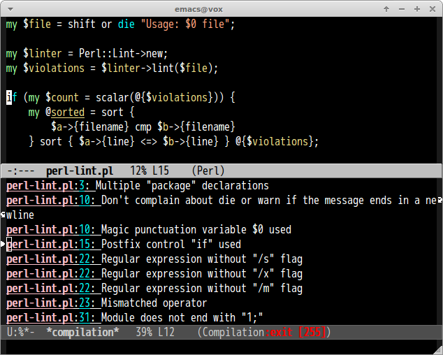

# perl-lint.el

## Introduction

[Perl::Lint](https://github.com/moznion/Perl-Lint) for Emacs

## Screenshot

## Requirements

- Perl
- Perl::Lint

## Basic Usage

#### `M-x perl-lint`

Lint file of current buffer.
